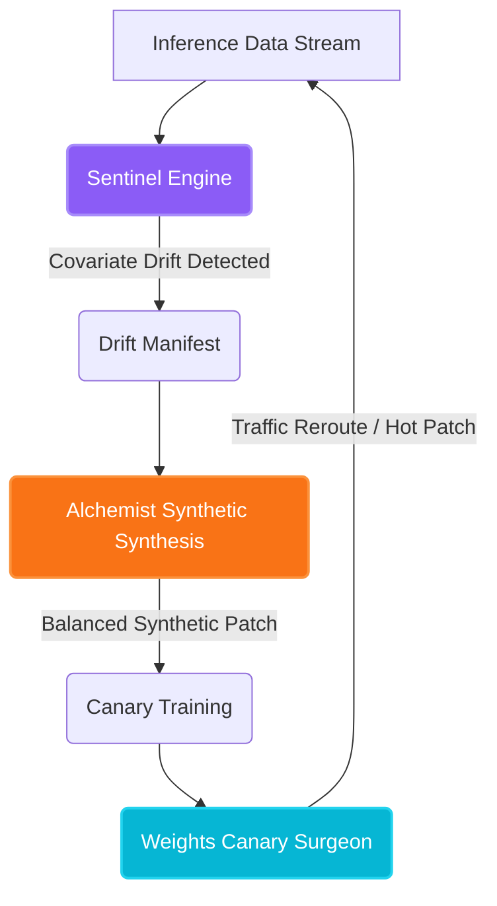

# Project Phoenix — Production Self-Healing MLOps Infrastructure
**Technical Whitepaper — Version 2026.2.0**

---

## Abstract
Modern high-frequency machine learning pipelines suffer from acute operational challenges due to statistical covariate shift and drift. Typically, remediation requires manual debugging, retraining, and redeployment cycles, which prolongs the Mean Time to Resolution (MTTR) and increases downtime. 

Project Phoenix introduces a production-ready, fully closed-loop **Sovereign Autonomous MLOps Framework** capable of:
1. Continuous passive drift analysis (Sentinel Engine).
2. Generative adversarial-cooperative high-fidelity synthetic data balancing (Alchemist Engine).
3. Surgical weight manipulation and zero-downtime canary traffic rerouting (Weights Canary Surgeon).

---

## 1. System Topology

The Project Phoenix architecture operates as a decentralized, self-healing loop:

---

## 2. Sentinel: Mathematical Drift Formulation

The Sentinel engine continuously monitors live serving inference feature batches $X_{live} \in \mathbb{R}^{B \times D}$ against reference baseline datasets $X_{ref} \in \mathbb{R}^{N \times D}$. 

To detect covariate shift, Sentinel computes the **Population Stability Index (PSI)** and **Wasserstein-1 Distance (Earth Mover's Distance)** per feature dimension $j$:

### 2.1 Population Stability Index (PSI)
$$PSI_j = \sum_{b=1}^{K} \left( P_{live, b} - P_{ref, b} \right) \times \ln\left( \frac{P_{live, b}}{P_{ref, b}} \right)$$

Where $K$ represents the number of binning intervals, $P_{live, b}$ is the proportion of points in bin $b$ for the live serving batch, and $P_{ref, b}$ is the reference cohort proportion.
- $PSI_j < 0.1$: Nominal (No drift).
- $0.1 \le PSI_j < 0.25$: Moderate Drift.
- $PSI_j \ge 0.25$: Severe Drift (Triggers autonomous healing).

### 2.2 Wasserstein Distance (EMD)
$$W_1(P_{live}, P_{ref}) = \inf_{\gamma \in \Pi(P_{live}, P_{ref})} \mathbb{E}_{(x, y) \sim \gamma}[\|x - y\|]$$

Sentinel leverages the dual Kantorovich-Rubinstein formulation to compute EMD concurrently across multi-processing worker pools using custom PyTorch C++ bindings for real-time latency shielding.

---

## 3. Alchemist: Structured DeepSeek Synthesis

When drift exceeds bounds, the **Alchemist Synthesis Engine** generates a remediation batch $X_{heal}$ designed to counter the active drift bias.

Instead of generic interpolation, Alchemist runs a structured adversarial debate loop using the DeepSeek v4-Pro Sovereign LLM model. It defines:
- **Bias constraints**: Forces synthesis to focus on minority edge cases that are under-represented due to covariate drift.
- **FinOps limits**: Computes active token pricing versus spot instance availability:
  $$\text{Budget Gate} = (\text{Input Tokens} \times P_{in} + \text{Output Tokens} \times P_{out}) < \text{Threshold}$$

The synthesized datasets are instantly subjected to:
1. **Cosine Diversity Index**:
   $$\text{CDI} = \frac{2}{M(M-1)} \sum_{i < j} \frac{x_i \cdot x_j}{\|x_i\| \|x_j\|}$$
2. **Governance Bias Check**: An automated statistical variance alignment test that verifies whether the synthetic batch mirrors the exact features while introducing necessary variance.

---

## 4. Weights Canary Surgeon: Traffic Routing

Once the challenger model $M_{challenger}$ is compiled, the **Canary Surgeon** executes a safe, zero-downtime transition using a modified Sigmoid-decay routing sequence:

$$R_{challenger}(t) = \frac{1}{1 + e^{-k(t - t_{mid})}}$$

Where $R_{challenger}(t)$ represents the active traffic proportion routed to the challenger, $k$ is the steepness rate coefficient, and $t_{mid}$ is the transition midpoint. Throughout this phase, a parallel shadow evaluator tests for **Shadow Outlier Stress**, monitoring latency and prediction variance between the production and canary nodes.

---

## 5. Security & Sovereignty
All data synthesis, local fallbacks, and model alignments are sealed locally within container boundaries. Local SQLite fallback storage guarantees that during offline network failures or cloud connectivity losses, the waitlist and drift diagnostic signals remain fully preserved, guaranteeing zero lead loss.
